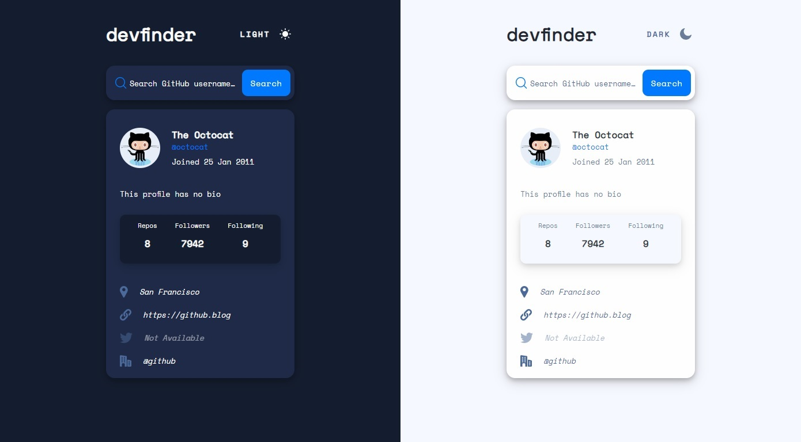

# GitHub user search app

This is a solution to the [GitHub user search app challenge on Frontend Mentor](https://www.frontendmentor.io/challenges/github-user-search-app-Q09YOgaH6).

## Table of contents

- [Overview](#overview)
  - [The challenge](#the-challenge)
  - [Screenshot](#screenshot)
- [My process](#my-process)
  - [Built with](#built-with)
  - [What I learned](#what-i-learned)
- [Author](#author)

## Overview

### The challenge

Users should be able to:

- View the optimal layout for the app depending on their device's screen size
- Search for GitHub users by their username
- See relevant user information based on their search
- Switch between light and dark themes
- Have the correct color scheme chosen for them based on their computer preferences.

### Screenshot

## My process

### Built with

- [React](https://reactjs.org/) - JS library
- [GitHub API](https://docs.github.com/en/rest?api) - GitHub API
- [Vite](https://vitejs.dev/) - Build tool
- [Prettier](https://prettier.io/) - Code formatter
- [ESLint](https://eslint.org/) - Syntax check

### What I learned

- work with Rest API
- dark mode on system preference

## Author

- GitHub - [Marek Vcelak](https://github.com/VcelakMarek)
